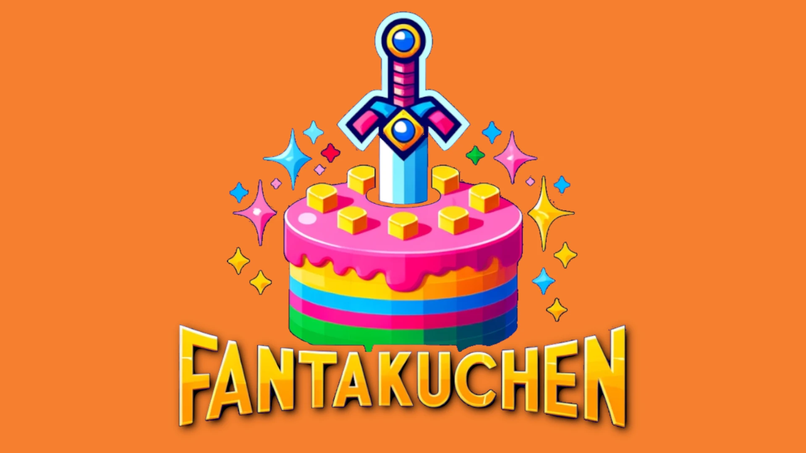

    

    

  

  
  

 

# Willkommen zu Fantakuchen!

WHY FANTACAKE?? Because, I watched This [This Video](https://www.youtube.com/watch?v=JheGL6uSF-4) at an ungodly hour of the morning, and felt clever using FantaKuchen...

WHO FANTACAKE?? An open source collective of people (well, me anyway) with far too much free time (me again...) and share an enjoyment of cake.

WHAT FANTACAKE?? Open Organisation for indie game development (Phaser, Three, Unreal.js) with no "suprise mechanics" or "buy this box" to win mechanics.

WANT FANTACAKE?? If you are interested in making multiplayer arcade games, get in touch!
